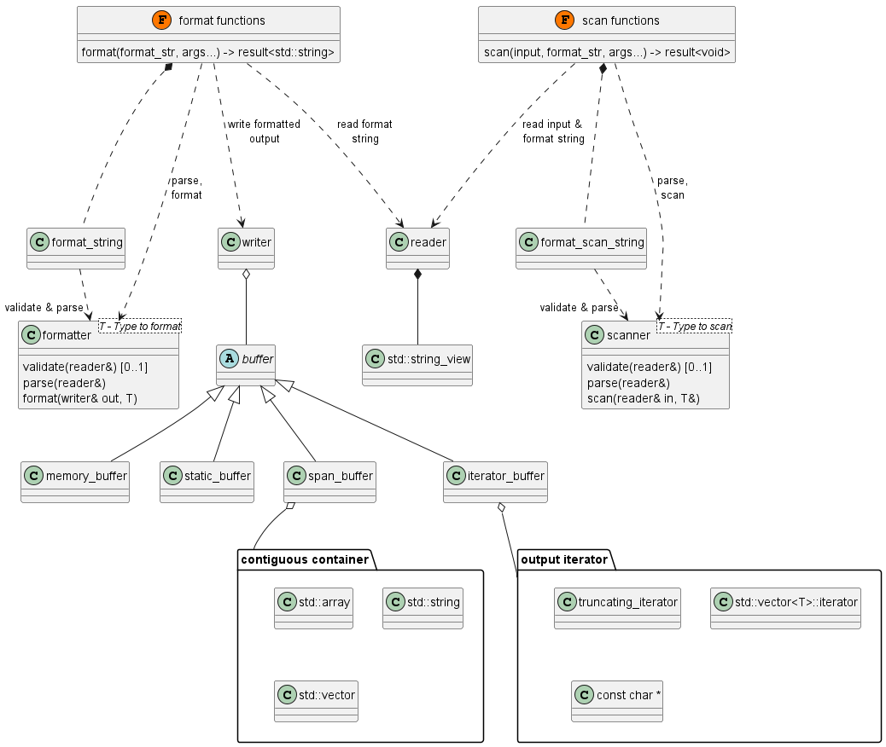

# Design

This is a short design overview of *emio*.

**Note:** [fmtlib/fmt](https://github.com/fmtlib/fmt) is an awesome library with great concepts and implementations
which are partly reused in this library. All statements made here by comparing *emio* with *fmt* are only objective and
shouldn't insult anybody's work.

## Binary footprint

The API provides a low level API for reading or writing builtin-types and also a high-level API for parsing (TODO) or
formatting, which reuses the low-level API. Additional, even when using the high-level API, only used types increase the
binary size. Furthermore, since the parse or format string can be validated at compile-time, the validation can be
omitted at runtime.

This is e.g. different in *fmt*, which doesn't provide a low-level API. Also, *fmt* instantiates all builtin types (e.g.
bool, int64_t, int128_t, long double...) even if only int32_t should be formatted. Last but not least, the format
string is validated at compile-time and runtime.

Take the following code snippet as example which is compiled and statically linked.

```cpp
std::string f = emio::format("{}", 1);
```

If compiled with *fmt*, **191 kBytes** of flash memory is required. If *emio* is used, only **5 kBytes** are requires.
This is **38 times** less! Keep in mind that flash memory of many microcontrollers is between 128 kBytes and 2 MBytes.

This huge advantage of *emio* comes with a price: *emio* doesn't support all features of *fmt*. But these features are
likely not so important for embedded systems. Some missing features are:

- no std::locale support (no internationalization)
- if a runtime format string is used, validation and parsing happens sequential (performance overhead)
- some features cannot be API compatible and have to be done differently (e.g. make_format_args requires the format
  string or dynamic width and precision is implemented by a wrapper object)

## Result type

Instead of C++-exceptions, `emio:result` is used for returning and propagating errors. It is similar to `std::expected`,
`boost::outcome` or Rust's `Result`.

`emio::result<T>` does either holds the expected value of type T or an unexpected error of type `emio::err`. Through
observer methods, the state and the value or the error can be visited.

```cpp
emio::result<std::string> format(...) noexcept;

emio::result<char> get_first_digit_of_pi() noexcept {
    emio::result<std::string> pi_as_str = format("{}", M_PI);
    if (pi_as_str) {
        return pi_as_str->at(0);
    }
    return emio::err::invalid_data;
}
```

To reduce the if/else chain, emio provides two simple macros (similar to *boost::outcome*) `EMIO_TRY` and `EMIO_TRYV`.
The above function could be rewritten into:

```cpp
emio::result<std::string> format(...) noexcept;

emio::result<char> get_first_digit_of_pi() noexcept {
    EMIO_TRY(std::string pi_as_str, format("{}", M_PI));
    return pi_as_str.at(0);
}
```

The biggest advantage of using a result type is that error handling is still possible even if C++-exceptions are
disabled. Unlike other libraries like *fmt*, which mostly terminate deep inside their library if an error occurs, the
result object propagates the error back to the callee. The drawback is of course the small performance overhead and
the explicit handling of the control flow.

## Performance

The current benchmarks show that the formatting is round about 1.5 - 2 times slower than fmtlib and the performance is
similar to printf (e.g. for integer types). Scanning on the other hand is around twice as fast then scanf. See the
benchmark tests inside the CI for more details.

## Class diagram



See also [API](API.md) notes.